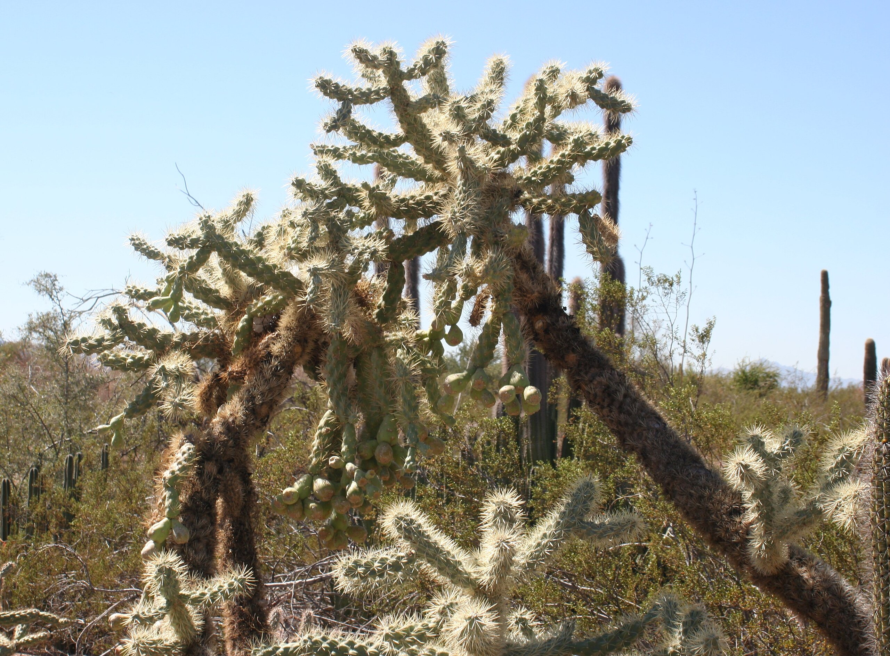
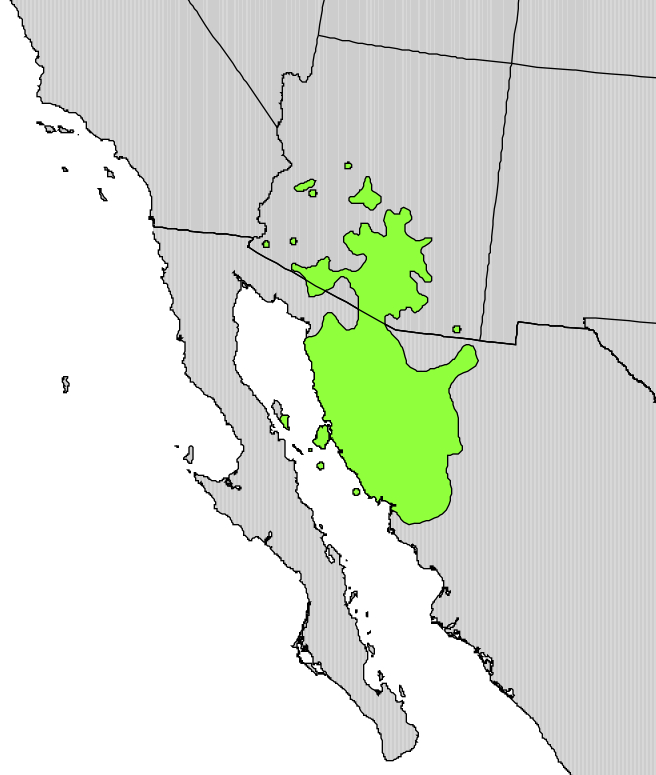
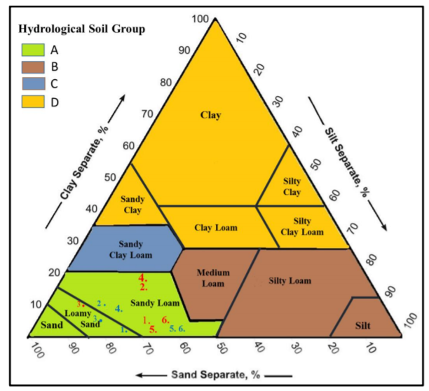
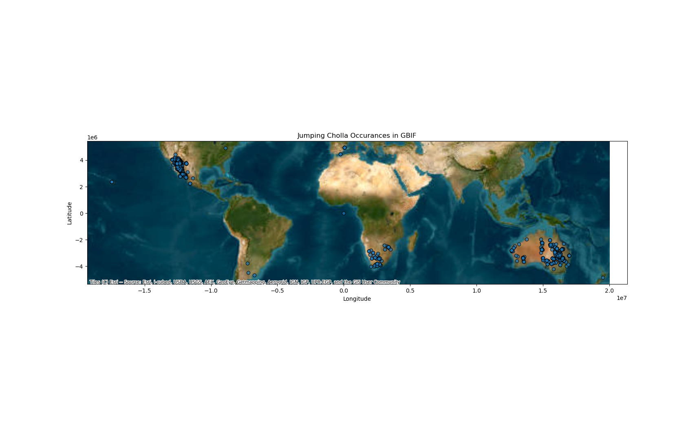
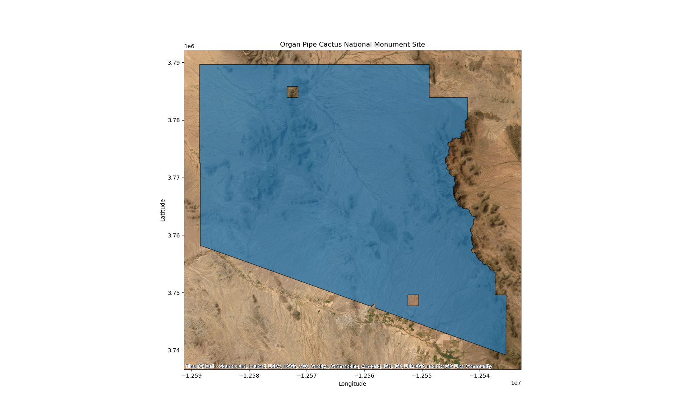
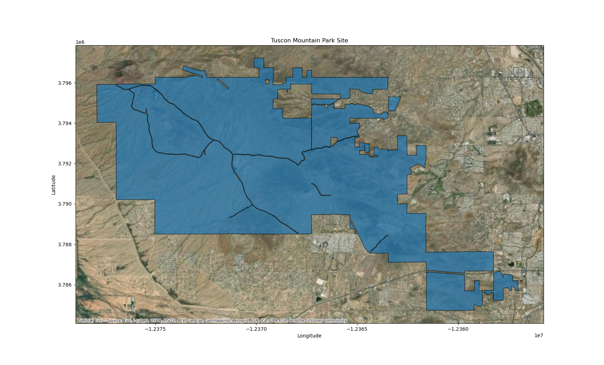
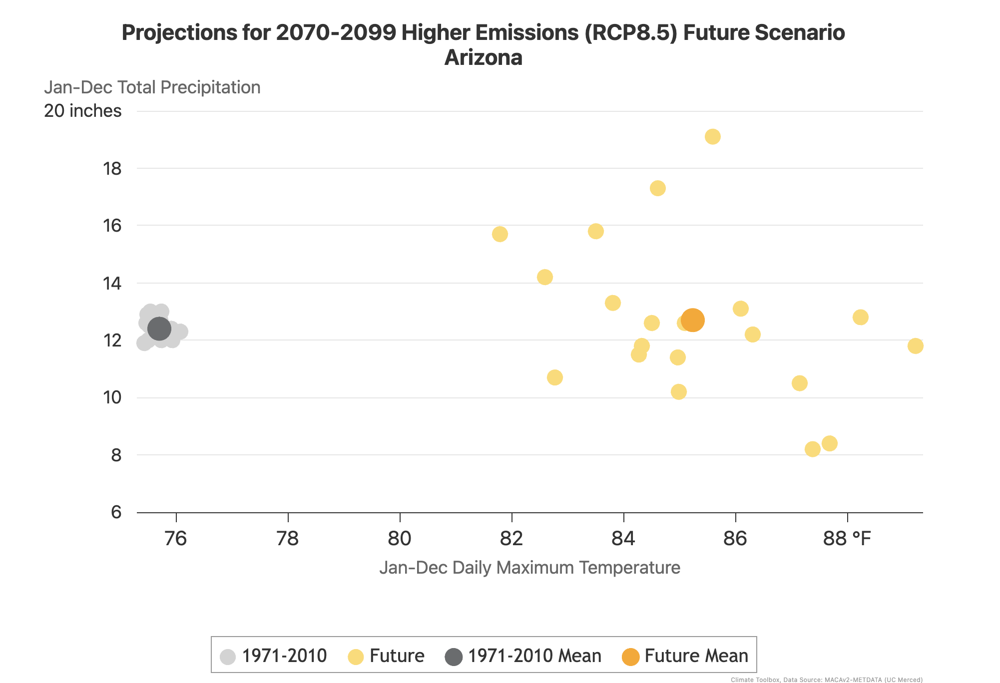
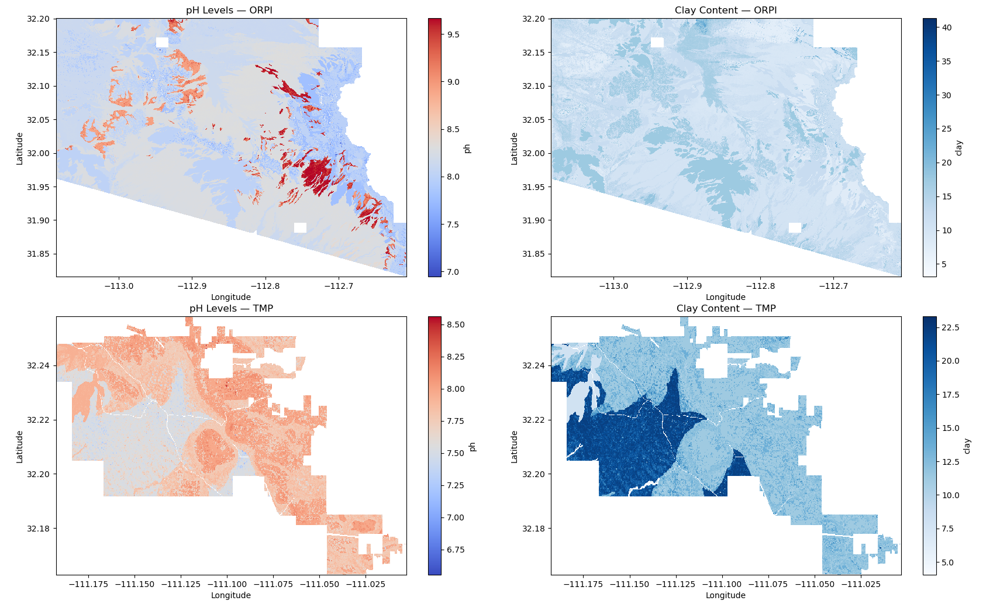
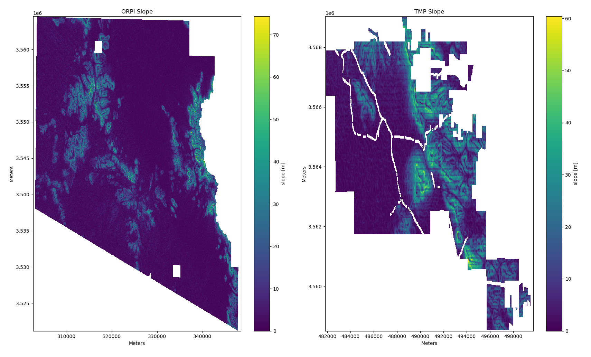

## Habitat suitability under climate change
### Study Overview
#### Question
In this coding challenge my goal was to create a habitat suitability model for Cylindropuntia fulgida, or Jumping Cholla, a cactus native to the Southwest United States and Northern Mexico. I aimed to answer the question of will Jumping Cholla's range be constrained or expanded by the changing temperature and percipitation caused by climate change. 

#### Species
I decided to do my study on Cylindropuntia fulgida, or Jumping Cholla. Jumping Cholla's are a type of cactus native to Arizona and Northern Mexico, and are populus in the Sonoran desert. They are known as Jumping Chollas because of how easy it is for the stems to detach when brushed, which makes it seem like the stems are nearly jumping off the cactus. This ease of detachment lets the cholla attach itself to desert animals and seeds be dispersted.

Since cholla's exist in already harsh and unfogiving enviornments, their population is stable. I wondered if the highest climate extremes would be able to push even a stable plant's suitability zones. Information on the optimal soil, topographic, and climate variables was difficult to assertain so I mixed information on suitabile variables for both jumping cholla's specifically and catus in general. 

##### Soil Variables
The best soil condiditions for jumping cholla's are ones that are fertile, gravel-rich, water-permeable soil with a pH of between 6 and 7. Generally cactus will do well in soil with a pH of between 5 and 7, as they prefer slight acidity. Since the POLARIS data set does not include percent gravel in their data I collected the percent clay and determined if the clay percentage was under 35% then it would be more optimal and more likely to be a well drained soil. I also used the mean clay % and pH level at 5-15 cm below the ground to account for catis shallow roots.

##### Topograpgic Variables
Jumping chollas grow from 980 to 3,280 feet in elevation and likely can withstand steep slopes, so I selected 50% slope as my maximum slope with under 30% being ideal.

##### Climate Variables
For temperature I determined the ideal range to be between 15 - 38 ℃ and the temperature tolerance to be between -5 - 43 ℃. For percipitation I was unable to find research on speficially Jumping Cholla's but found that saguaro cacti surive in an ideal range 180 to 425 mm and can handle up to 500 mm of rainfall per year and down to 25 mm of rainfall annually. 

The major limiting factors for jumping cholla are cold winters, dry summers, and too much rainfall with low soil permability. 

#### Sites
To select sites I downloaded GBIF data and compared it to the Preservation Areas in the United States to determine which areas had the highest number of Jumping Cholla's recorded. 

I was able to determine that Organ Pipe Cactus National Monument and Tuscon Mountain Park had the highest number of Jumping Cholla's recorded.

Organ Pipe Cactus National Monument is located in the very Southern part of Arizona and shares a boarder with Mexico. It is 517 sq mi big, most of which is a wilderness area. It is the only place in the U.S. where senita and organ pipe cactus grow wild, and is home to many different cactus species. 

Tucson Mountain Park is a 20,000 acre park located to the West of Tucson, Arizona, and shares its Northern boarder with Saguro National Park West. 

#### Time periods
I wanted to compare the extremes on both ends of the specturm, so I chose to look at a historical time period of 1950-1979 and a late century time period of 2064-2096. 

### Climate models
Due to the uncertainty among global climate models, four different climate models were chosen to include scenarios that were warm and wet, warm and dry, cold and wet, and cold and dry. To select these I used the Climate Futures Toolbox Future Climate Scatter tool. 

 

The climate models I decided to use were:

Cold and wet: MRI CGCM3

Hot and dry: IPSL CM5A MR

Hot and wet: CanESM2

Cold and dry: inmcm4

##### Citations
Climate Toolbox. (n.d.). Future climate scatter. Climate Toolbox. https://climatetoolbox.org/tool/Future-Climate-Scatter
Helmy, O. (2021). Carnegiea gigantea, saguaro. Fire Effects Information System. U.S. Department of Agriculture, Forest Service, Rocky Mountain Research Station. https://www.fs.usda.gov/database/feis/plants/cactus/cargig/all.pdf
Iowa State University Extension and Outreach. (n.d.). Gardening on slopes and hillsides. Iowa State University Extension and Outreach. https://yardandgarden.extension.iastate.edu/how-to/gardening-slopes-and-hillsides
PictureThis. (n.d.). How to grow and care for jumping cholla (Cylindropuntia fulgida). PictureThis. https://www.picturethisai.com/care/Cylindropuntia_fulgida.html
Wikipedia contributors. (n.d.). Cylindropuntia fulgida. Wikipedia. https://en.wikipedia.org/wiki/Cylindropuntia_fulgida
Wikipedia contributors. (n.d.). Organ Pipe Cactus National Monument. Wikipedia. https://en.wikipedia.org/wiki/Organ_Pipe_Cactus_National_Monument

### Data Access
#### Soil data

Using the POLARIS dataset I downloaded mean clay % and soil pH at a depth of 5-15 cm for each site. 
     
#### Topographic data

Using the SRTM dataset, downloaded through the earthaccess API, I downloaded elevation data for each site. 

Next I calculated the slope of the SRTM elevation dataset using the xrspatial package. 
     
#### Climate model data
I downloaded MACAv2 data for historical data (1950-1979) and higher emmisions RCP8.5 future climate data (2064-2096), using the four climate models I selected using the Climate Futures Toolbox Future Climate Scatter tool. I downloaded the max temperature data for each one of my sites, models, and time periods. 

Northwest Knowledge Network. (n.d.). REACCH climate CMIP5 MACAV2 catalog. Northwest Knowledge Network. https://www.reacchpna.org/thredds/reacch_climate_CMIP5_macav2_catalog2.html

STEP 3: HARMONIZE DATA
Try It
Make sure that the grids for all your data match each other. Check out the ds.rio.reproject_match() method from rioxarray. Make sure to use the data source that has the highest resolution as a template!

Warning

If you are reprojecting data as you need to here, the order of operations is important! Recall that reprojecting will typically tilt your data, leaving narrow sections of the data at the edge blank. However, to reproject efficiently it is best for the raster to be as small as possible before performing the operation. We recommend the following process:

1. Crop the data, leaving a buffer around the final boundary
2. Reproject to match the template grid (this will also crop any leftovers off the image)
     
STEP 4: DEVELOP A FUZZY LOGIC MODEL
A fuzzy logic model is one that is built on expert knowledge rather than training data. You may wish to use the scikit-fuzzy library, which includes many utilities for building this sort of model. In particular, it contains a number of membership functions which can convert your data into values from 0 to 1 using information such as, for example, the maximum, minimum, and optimal values for soil pH.

Try It
To train a fuzzy logic habitat suitability model:

1. Research S. nutans, and find out what optimal values are for each variable you are using (e.g. soil pH, slope, and current climatological annual precipitation). 
2. For each **digital number** in each raster, assign a **continuous** value from 0 to 1 for how close that grid square is to the optimum range (1=optimal, 0=incompatible). 
3. Combine your layers by multiplying them together. This will give you a single suitability number for each square.
4. Optionally, you may apply a suitability threshold to make the most suitable areas pop on your map.
Tip

If you use mathematical operators on a raster in Python, it will automatically perform the operation for every number in the raster. This type of operation is known as a vectorized function. DO NOT DO THIS WITH A LOOP!. A vectorized function that operates on the whole array at once will be much easier and faster.

# Create fuzzy logic suitability model
     
STEP 5: PRESENT YOUR RESULTS
Try It
Generate some plots that show your key findings. Don’t forget to interpret your plots!

# Create plots
     
YOUR PLOT INTERPRETATION HERE

